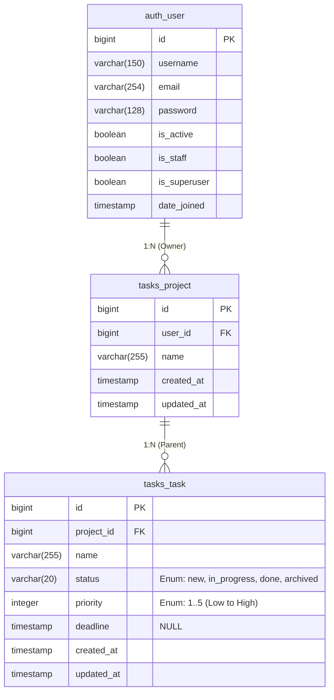

# Entity Relations Diagram

This document describes the database entity relationships for the Django Task Management Application.

## Overview

The application follows a hierarchical structure: **User** ’ **Projects** ’ **Tasks**, where users can create multiple projects, and each project can contain multiple tasks.

## Entity Relationship Diagram



## Entity Descriptions

### auth_user (Django User Model)
- **Primary Entity**: Django's built-in User model with username/email authentication
- **Key Features**:
  - Standard Django User fields
  - Username and email fields available
  - Built-in permission system
- **Business Rules**:
  - Username and email should be unique
  - Users can have unlimited projects

### tasks_project
- **Purpose**: Organizational unit for grouping related tasks
- **Key Features**:
  - Belongs to a single user (ForeignKey to auth_user)
  - Simple name field for project identification
  - Automatic timestamp tracking
- **Business Rules**:
  - Each project must have an owner (user)
  - Project names should be descriptive

### tasks_task
- **Purpose**: Individual work items within a project
- **Key Features**:
  - Belongs to a single project (ForeignKey to tasks_project)
  - Status workflow: new ’ in_progress ’ done ’ archived
  - Priority levels from 1 (Low) to 5 (High)
  - Optional deadline field
- **Business Rules**:
  - Tasks cannot exist without a project
  - Users can only access tasks in their own projects
  - Status must be one of the defined enum values
  - Priority must be between 1 and 5

## Database Constraints

### Foreign Key Relationships
```sql
-- Project to User relationship
ALTER TABLE tasks_project ADD CONSTRAINT fk_project_user 
    FOREIGN KEY (user_id) REFERENCES auth_user(id) ON DELETE CASCADE;

-- Task to Project relationship
ALTER TABLE tasks_task ADD CONSTRAINT fk_task_project 
    FOREIGN KEY (project_id) REFERENCES tasks_project(id) ON DELETE CASCADE;
```

### Indexes (for Query Optimization)
```sql
-- Project queries by user
CREATE INDEX idx_tasks_project_user_id ON tasks_project(user_id);
CREATE INDEX idx_tasks_project_user_created ON tasks_project(user_id, created_at DESC);

-- Task queries by project and status
CREATE INDEX idx_tasks_task_project_id ON tasks_task(project_id);
CREATE INDEX idx_tasks_task_project_status ON tasks_task(project_id, status);
CREATE INDEX idx_tasks_task_project_created ON tasks_task(project_id, created_at DESC);
```

## Status and Priority Enums

### Task Status Workflow
- **new**: Task just created, not started
- **in_progress**: Task is being worked on
- **done**: Task completed successfully
- **archived**: Task completed and archived

### Priority Levels
- **1**: Very Low priority
- **2**: Low priority  
- **3**: Medium priority
- **4**: High priority
- **5**: Very High priority

## Query Patterns and Optimizations

### Common Query Scenarios

1. **Get all projects for a user with task counts**:
```python
# Optimized query preventing N+1 problem
projects = Project.objects.filter(user=user).annotate(
    task_count=Count('tasks'),
    completed_count=Count('tasks', filter=Q(tasks__status='done'))
).order_by('-created_at')
```

2. **Get all tasks for a user across projects**:
```python
# Single query with select_related
tasks = Task.objects.filter(
    project__user=user
).select_related('project').order_by('-created_at')
```

3. **Get project with all its tasks**:
```python
# Use prefetch_related for reverse ForeignKey
project = Project.objects.filter(
    id=project_id, user=user
).prefetch_related('tasks').first()
```

## Data Access Layer (DAL) Methods

Based on these relationships, the DAL classes should implement:

### UserDAL
- `get_by_username(username: str) -> User`
- `get_by_email(email: str) -> User`
- `create_user(username: str, email: str, **kwargs) -> User`

### ProjectDAL
- `get_user_projects(user: User) -> QuerySet[Project]`
- `get_by_id_and_user(project_id: int, user: User) -> Project`
- `create(user: User, name: str, **kwargs) -> Project`

### TaskDAL
- `get_project_tasks(project: Project) -> QuerySet[Task]`
- `get_user_tasks(user: User) -> QuerySet[Task]`
- `get_by_status(project: Project, status: str) -> QuerySet[Task]`
- `create(project: Project, name: str, **kwargs) -> Task`

## Migration Strategy

1. **Phase 1**: Use Django's built-in User model
2. **Phase 2**: Create Project model and migration
3. **Phase 3**: Create Task model and migration
4. **Phase 4**: Add indexes for performance
5. **Phase 5**: Add data validation and constraints

## Notes

- All timestamps use Django's `auto_now_add` and `auto_now` for created_at/updated_at
- Task status should use Django choices for data integrity
- Priority field should have min/max validators (1-5 range)
- Deadline field is optional (NULL allowed)
- Consider adding soft deletes later if needed