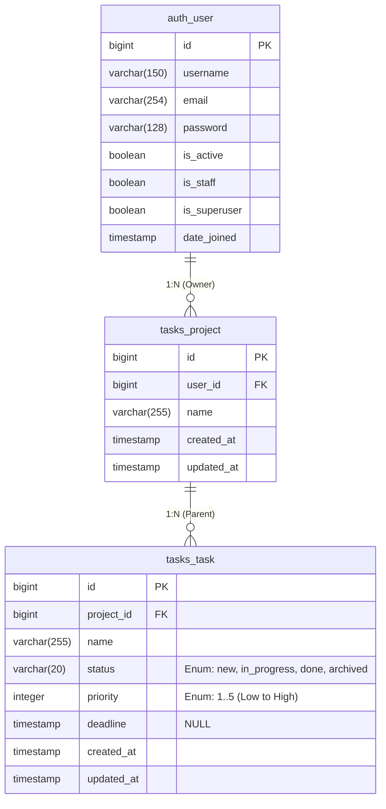

# Entity Relations Diagram

This document describes the database entity relationships for the Django Task Management Application.

## Overview

The application follows a hierarchical structure: **User** � **Projects** � **Tasks**, where users can create multiple projects, and each project can contain multiple tasks.

## Entity Relationship Diagram

